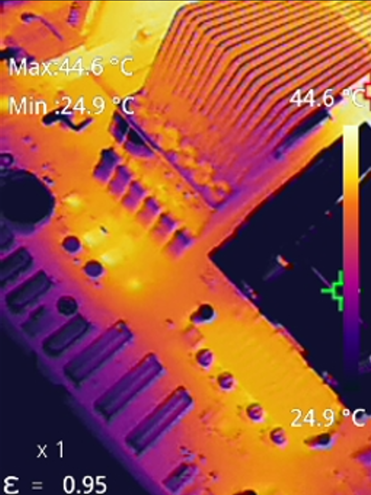

# ddr5-rdimm-heatsink

Adapted from the excellent https://github.com/galvesribeiro/ddr5-rdimm-heatsink project. The least I could do is retain the incredibly permissive license.

While enthusiast-level water cooling of RAM sticks is definitely a thing, I'm not aware of any commercial RAM blocks that support RDIMM modules. With 64 GB modules drawing upwards of 8 watts, relying on case airflow (that does not require hearing protection) over naked RAM sticks is hopeless. 

I wanted to address a couple of things in galvesribeiro's project:

1) Support higher RDIMM density (server boards have much tighter RDIMM spacing than he anticipated).
2) Support passive air cooling as an option instead of active water blocks.

## Passive Configuration, RAM Blocks

- [`ramblock-passive-body.step`](./ramblock-passive-body.step): The main shell of the RAM block.
- [`ramblock-passive-lid.step`](./ramblock-passive-lid.step): The smaller piece of the RAM block shell.
- [`ramblock-passive-threads.pdf`](./ramblock-passive-threads.pdf): Technical drawing for coarse M3 threads.

## Passive Configuration, Heatspreaders

- [`heatsink-4rdimm-8mmc2c.step`](./heatsink-4rdimm-8mmc2c.step): The heatsink to place atop 4 RDIMMs. Expects the RDIMM spacing on the motherboard to be 8mm center-to-center. 
- [`heatsink-6rdimm-8mmc2c.step`](./heatsink-6rdimm-8mmc2c.step): The heatsink for 6 RDIMMs with the same spacing.

Virtually all current server boards that I'm aware of follow the 8mm c2c pattern within tolerance.

## Active Configuration, RAM Blocks

This is closer to galvesribeiro's original project, expecting an AlphaCool Apex water block to be mounted on top of the RAM blocks. The mounting holes atop the block have been adjusted to accommodate that.

- [`ramblock-alphacool-body.step`](./ramblock-alphacool-body.step): The main shell of the RAM block.
- [`ramblock-alphacool-lid.step`](./ramblock-alphacool-lid.step): The lid of the RAM block shell.
- [`ramblock-alphacool-threads.pdf`](./ramblock-alphacool-threads.pdf): Technical drawing for coarse M3 threads.

## Manufacturing

Any competent CNC shop should be able to machine these. The passive heatspreaders might require wire EDM.

SLS 3D printing from aluminum might work for the blocks. Milling definitely does. 

You could spring for copper, but IMO it's not worth it; aluminum is fine, cheaper, and much lighter. You can have it anodized.

Make sure you have the threads tapped. The holes are sized for M3 coarse. Threads aren't modeled but are included in the PDFs.

## Assembly Notes

- Cover both sides of the RDIMM modules with 0.5mm thick thermal pads.
- Place the RDIMM modules in a consistent orientation (the face-up side does not matter but should follow your pattern) snugly against the top and left edges of the base.
- Fasten the lids on the bodies using M3x6 flat (countersunk) screws. 
- The heatspreaders install with your choice of non-countersunk M3x8 screws. Use a large sheet of 0.5mm thermal pad between the RAM blocks and the heatspreader.

## Pics or it did not happen

Supermicro H13SSL-NT with 12x64GB Nemix (Micron MTC40F2046S1RC56BD2QLFF) modules @5600GT/s.

```bash
marton@hal9001:~$ sudo ipmitool sdr | grep DIMM
DIMMA~F Temp     | 36 degrees C      | ok
DIMMG~L Temp     | 36 degrees C      | ok
```




