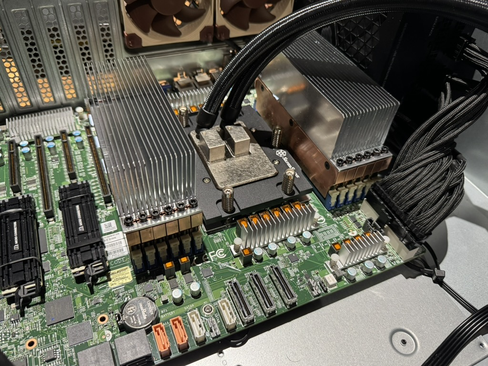

# ddr5-rdimm-heatsink v2.0.0

Adapted from the excellent https://github.com/galvesribeiro/ddr5-rdimm-heatsink project. The least I could do was keep the incredibly permissive license intact.

While enthusiast-level water cooling of RAM sticks is definitely a thing, I'm not aware of any commercial RAM blocks that support RDIMM modules. With 64 GB modules drawing ≈8-10W each at peak, relying on case airflow (that does not require hearing protection) over naked RAM sticks is hopeless. 

I wanted to address a couple of things in galvesribeiro's project:

1) Support higher RDIMM density (server boards have much tighter RDIMM spacing than he anticipated).
2) Support passive air cooling as an option instead of active water blocks.

## RAM Blocks

- [`ramblock-body.step`](./ramblock-body.step): The main shell of the RAM block.
- [`ramblock-lid.step`](./ramblock-lid.step): The lid of the RAM block shell.
- [`ramblock-body.pdf`](./ramblock-body.pdf): Technical drawing for coarse M3 threads.

These will fit both the Alphacool Apex water block or the passive heatspreader below.

## Heatsinks

- [`heatsink-4rdimm-8mmc2c.step`](./heatsink-4rdimm-8mmc2c.step): The heatsink to place atop 4 RDIMMs. Expects the RDIMM spacing on the motherboard to be 8mm center-to-center. 
- [`heatsink-6rdimm-8mmc2c.step`](./heatsink-6rdimm-8mmc2c.step): The heatsink for 6 RDIMMs with the same spacing.

Virtually all current server boards follow the ≈8mm c2c pattern within tolerance. The RAM block is designed to be 7.4mm wide, this will very slightly change due to manufacturing error. If you measure between 7.5mm to 8mm on your board, the modules will fit. 

If your DIMMs are further apart than 8mm, you might be able to use the wider heatsink designed for 6 DIMMs, and place it atop 4 RDIMMs. Do NOT use the 4-DIMM version because the mounting screws will not fit the outer modules. If there is too much overhang, put your exact measurements in a GitHub issue and I should be able to create a version of the model that fits. (Or modify it yourself based on the .step file, and send a PR.)

This probably goes without saying but absolutely make sure that the block + heatspreader will fit your CPU cooling and case. The heatspreader + thermal pad + block stack adds just under 50mm to your RAM height, and a couple of millimeters to its width. There's no air cooling option that this will fit under. The stack was designed with the exact limits of a 2U case in mind, but never actually tested in one. 

## Manufacturing

Any competent CNC shop should be able to machine these parts. The heatspreaders might require wire EDM.

### Material 

You could spring for copper, but IMO it's not worth it; aluminum is fine - cheaper, and much lighter. You can have it anodized.

### Threads

Make sure you have the threads tapped. The holes are sized for M3 coarse. Threads aren't modeled but are included in the PDF.

### Capacitor Fitment

IMPORTANT: RDIMM modules have capacitors that stick out above the RAM chips by ~1.2mm. Their size isn't part of a JEDEC standard, but the caps are typically B2-case or MLCC, just under 2mm tall, while the RAM chips themselves tend to be ~0.8mm. This means a delta of approximately 1.2mm. Generally these tall caps are only on one side of the RDIMM[^oneside]. The other side might have components that reach above the plane of the memory ICs, but much less so. The `base` part allows for a delta of 0.9mm (+/- manufacturing tolerances, + extra thermal pad squish[^squish].) The `lid` part allows for 1.3mm (+/- tolerances, + extra squish[^squish]). Please look at your RDIMMs and make sure that they don't need increased accommodation over these numbers.


### Thin Parts

The heatsink as designed has 1.2mm wide fins. You shouldn't get any pushback from the CNC house - but if you do, it should be safe to tell them that you accept the risk and want them to proceed anyway. V1 of this project had a heatsink fin width 0.78mm (outer) and 0.74mm (inner), and both myself and [one other person](https://github.com/martona/ddr5-rdimm-heatsink/issues/2) got acceptable results from PCBWay. V2 increased fin width to 1.2mm, and I received 6 absolutely perfect parts from them that were made to this updated spec - with no initial pushback. 


## BOM 
- 1x `lid` and 1x `body` per RDIMM. 
- 1x `heatsink-4rdimm` per 4 RDIMMs or 1x `heatsink-6rdimm` per 6 RDIMMs.
- 3x M3x6 flat-head countersunk coarse screw per RDIMM, e.g. McMaster-Carr 92125A126 (hex drive) or 91801A151 (Philips).
- 2x 120mm x 20mm x 0.5mm thermal pad per RDIMM. You can get decent 6W/mK pads for not much more than the cheap 1W/mK stuff. Thermal Grizzly has a line too if there's something burning a hole in your pocket.
- 1x 100mm x 47mm x 0.5mm thermal pad per 6-RDIMM heatsink. You can cut down a larger piece to this size or combine multiple smaller pieces.
- 1x 100mm x 31mm x 0.5mm thermal pad per 4-RDIMM heatsink. 
- 12x M3x8 non-countersunk coarse screw per 6-RDIMM heatsink.
- 8x M3x8 non-countersunk coarse screw per 4-RDIMM heatsink.
- Optional: ≥14mm wide Kapton tape, see below.

## Assembly Notes

- This first step is optional, but if this footnote[^squish] has you worried in the slightest, you can cover the bottom of the capacitor cutout windows with Kapton tape. 
- Cover both sides of the RDIMM modules with 0.5mm thick thermal pads. Remove RDIMM stickers/labels if you want - or not. Paper is a very bad thermal conductor but here it's also very thin.
- Place the RDIMM modules in a consistent orientation (tall caps facing upwards) snugly against the top and left edges of the base.
- Fasten the lids on the bodies using M3x6 flat (countersunk) screws. 
- Use a large sheet of 0.5mm thermal pad between the RAM blocks and the heatspreader. 
- The heatspreaders install with your choice of non-countersunk M3x8 screws. Washers are optional, small-OD types might even fit :). Do not over-tighten these screws: you just want to make sure that they're secure, and the surface of the RAM blocks are level with one another. 

## Other

Do check out the notes filed in [this issue](https://github.com/martona/ddr5-rdimm-heatsink/issues/2), it has some excellent tips on BOM, sourcing and ordering.

## Pics or it did not happen (from V1)

Supermicro H13SSL-NT with 12x64GB Nemix (Micron MTC40F2046S1RC56BD2QLFF) modules @5600MT/s.

```bash
marton@hal9001:~$ sudo ipmitool sdr | grep DIMM
DIMMA~F Temp     | 36 degrees C      | ok
DIMMG~L Temp     | 36 degrees C      | ok
```





# Changelog

- 2025-06-12 - V2.0
    - Increased heatspreader fin width to 1.2mm for better manufacturability.
    - Consolidated water-cooled and air-cooled RAM blocks into a single design.
    - Extensive README updates.
- 2025-04-02 - V1.0

# Footnotes

[^oneside]: JEDEC requires the maximum module thickness (defined as the height of the PCB plus the height of the tallest component on each side) to be no greater than 4.33mm. The PCB being a nominal 1.27mm and RAM IC height being 2x ≈0.8mm leaves 1.46mm by which side A and side B capacitors can reach above the height of their respective RAM chip planes, combined. In other words, if one side exceeds RAM height by 1.2mm the other side can only exceed it by 0.26mm. (This assumes that RAM packages aren't significantly shorter than 0.8mm, but usually the opposite is true.)

[^squish]: The RAM block `base` has a capacitor cutout depth of 0.9mm which allows for a maximum capacitor height of 2.165mm (measured from the PCB's surface), while the `lid`'s cutout depth of 1.3mm allows for 2.565mm capacitor height. These limits are the absolute unsafe maximum, and cause complete displacement of thermal pad material between the capacitor and RAM block metal surface. MLCCs common on DDR5 RDIMM modules can have exposed electrical contacts on their side that extend all the way to the top. Displacing all insulating thermal pad material will cause these metal pads to contact the block's surface, shorting ground and VCC. Therefore the capacitors mounted on the RDIMM must be shorter than these maximum values.